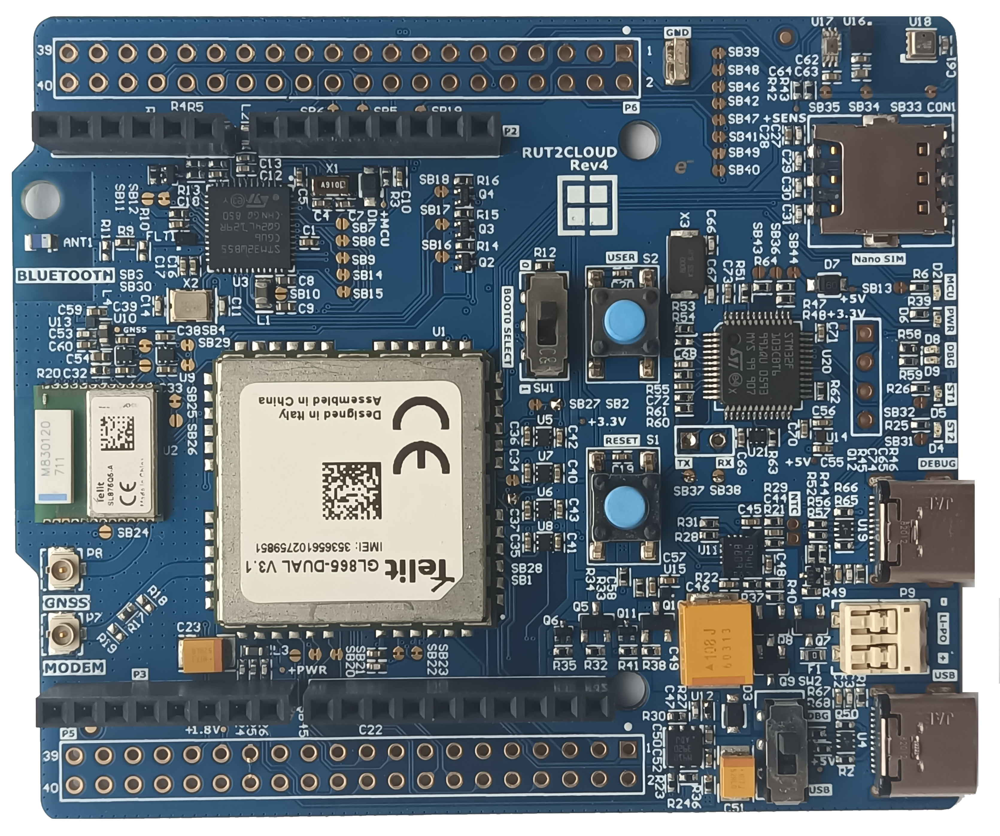

# RUT2CLOUD Evaluation Kit STM32WB55

This is the unreleased Rutronik development kit RUT2CLOUD Rev4. This board is featuring the GL865-DUAL 2G modem which is bundled together with the SL876Q5-A GNSS module and an STM32WB55 system-on-chip microcontroller that acts as a host of the system.

## Features

-   Telit GL865 DUAL V3.1 Cellular Modem (NL865 4G optional).
-   Telit SL876Q5-A GNSS Module.
-   Nano SIM card slot.
-   Ceramic Chip BLE Antenna ANT2012LL00R2400A.
-     STM32WB55CGU6 - Multiprotocol wireless 32-bit MCU Arm®-based Cortex®-M4  with FPU, Bluetooth® 5 and 802.15.4 radio solution.
-   L6924U - USB-compatible battery charger system with integrated power switch for Li-Ion/Li-Polymer.
-  LD39200PUR - 2 A high PSRR ultra-low drop linear regulator with reverse current protection.
-  STLQ020J18R - 1.8V 200 mA ultra-low quiescent current LDO.
-  STLQ020J33R – 3.3V 200 mA ultra-low quiescent current LDO.
-   LIS2DW12TR - MEMS digital output motion sensor: high-performance ultra-low-power 3-axis  "femto" accelerometer.
-   BH1730FVC-TR - Digital 16bit Serial Output Type  Ambient Light Sensor IC.
-   BME280 - Pressure, Humidity, Temperature Sensor.
-  
   Onboard ST-Link Debugger.

## Legal Disclaimer

The evaluation board including the software is for testing purposes only and, because it has limited functions and limited resilience, is not suitable for permanent use under real conditions. If the evaluation board is nevertheless used under real conditions, this is done at one’s responsibility; any liability of Rutronik is insofar excluded. 

